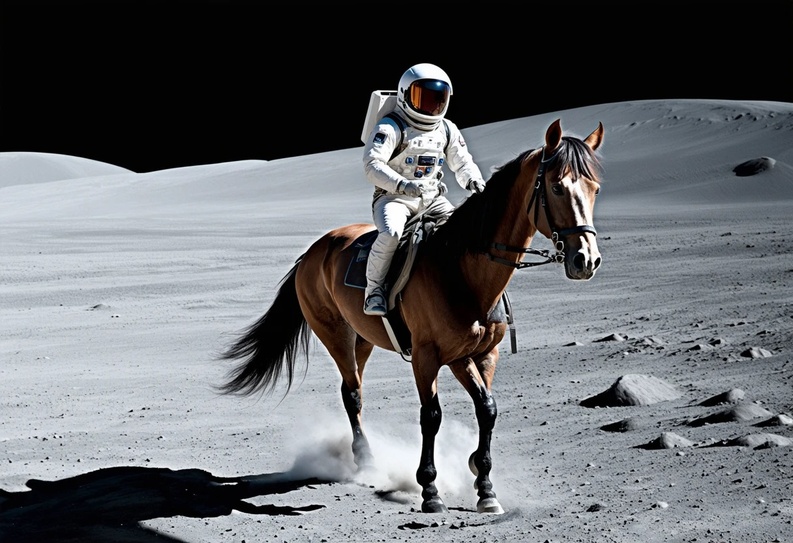
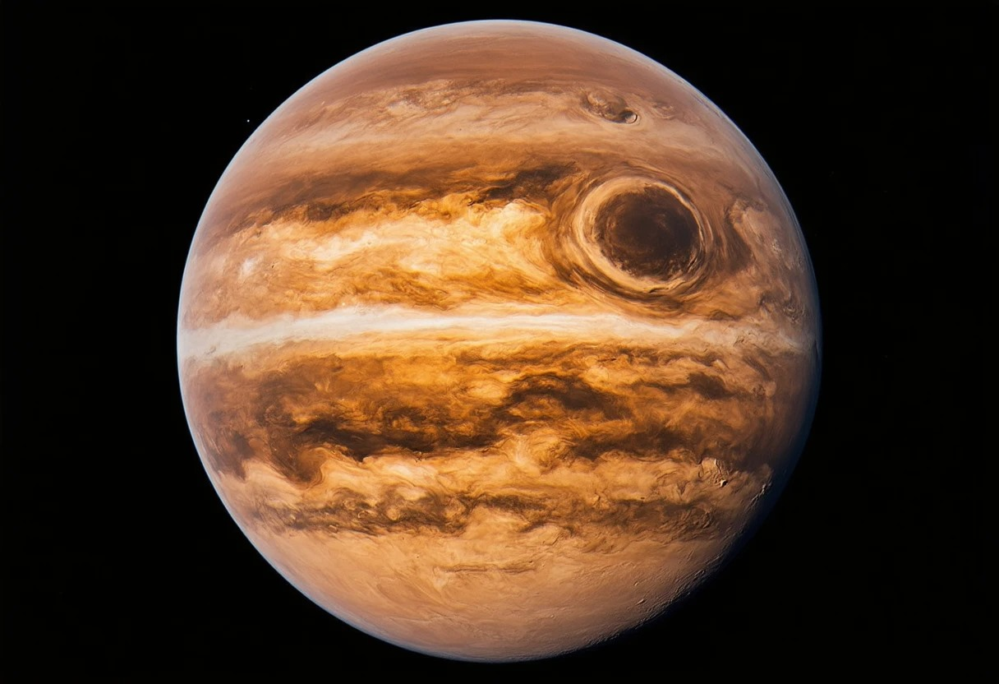
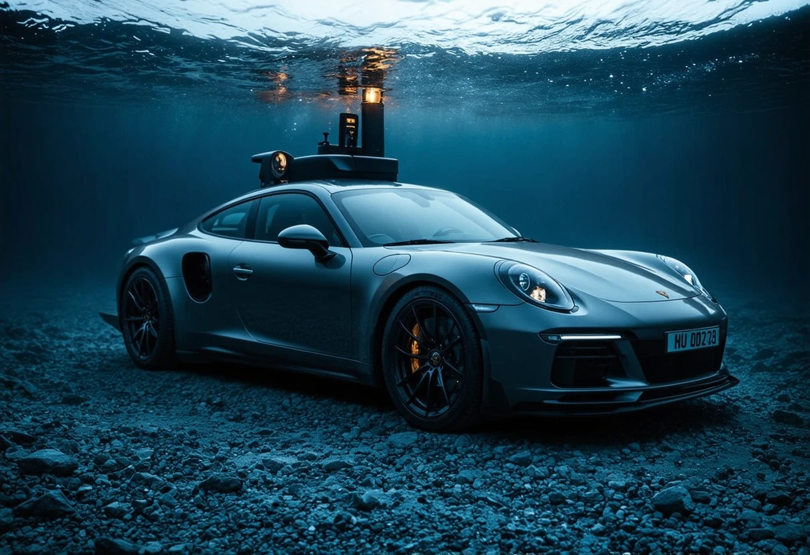
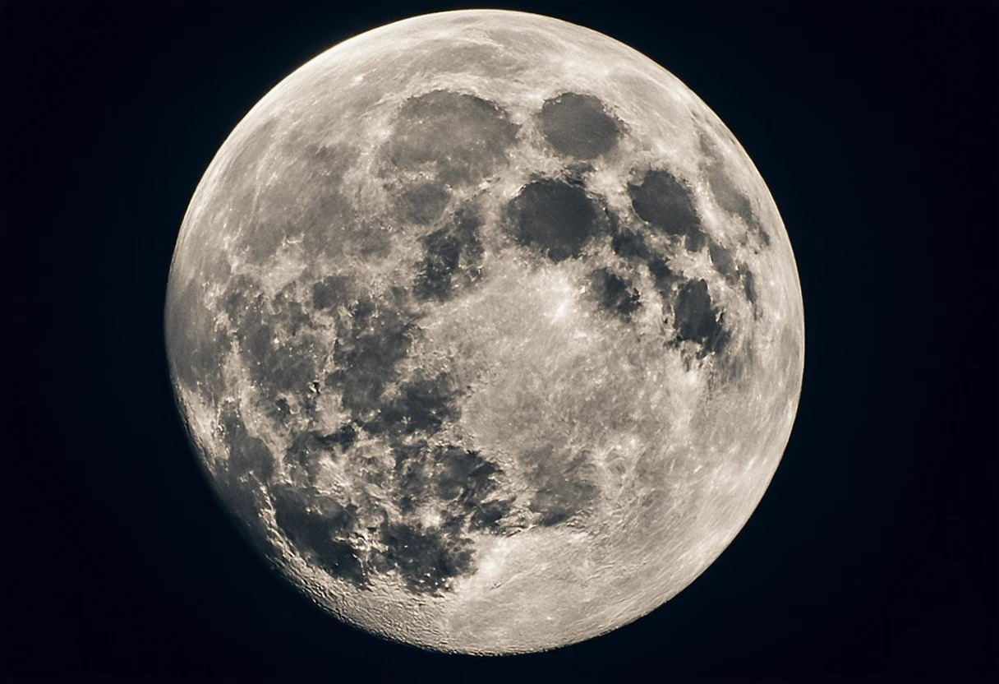
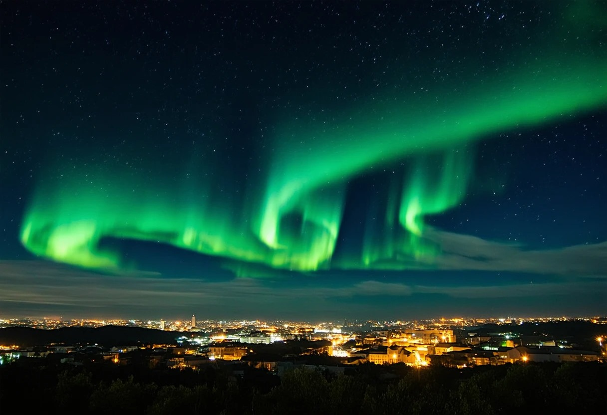

# Image Generation

## Instructions

Follow these steps to generate stunning images using this Python script powered by Selenium:

- **Sign In to GitHub:**
  - Ensure you are signed in to your GitHub account.

- **Launch Codespace:**
  - Click on the "Code" button above the file and launch a Codespace.

- **Install Python:**
  - Install Python in your Codespace if not already installed.
    ```bash
    sudo apt-get update
    sudo apt-get install python3.8
    ```
    
- **Install Selenium:**
  - Open the terminal in your Codespace and install Selenium using the command:
    ```bash
    pip install selenium
    ```

- **Run the Script:**
  - Execute the Python script by running the following command in your terminal:
    ```bash
    python main.py
    ```

- **Input Ideas:**
  - Follow the prompts in the terminal to input your ideas for image generation.

- **Generate Stunning Images:**
  - Sit back and watch as the script uses Selenium to create visually appealing images based on your inputs.

## Example prompt

### Astronaut riding a horse on the surface of moon, cinematic, high-resolution, 4k


# Exhibition

## Here are some of my creations

### 1.


### 2.


### 3.


### 4.


### 5.


### 6.


### 7.


### 8.


### 9.


### 10.


# Unleash your creativity and imagination here...

### try now!🎨
